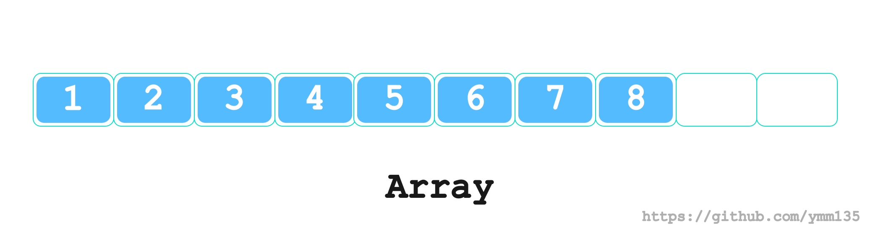

# 数组(Array)  
## 基本概念  
- 是由相同类型的元素(element)的集合所组成的数据结构，分配一块连续的内存来存储  
- 利用元素的索引(index)可以计算出该元素对应的存储地址   

<br>
<div align=center>
    </img>  
</div>
<br>

### c++ 数组基本使用  
```c++
#include <iostream>
#include <vector>
using namespace std;

int main()
{
    int a[10] = {0}; // 需要初始化, 否则会是未知值 {1, 2, 0, 0, 4196048, 0, 4195696, 0, -8688, 32767}

    a[0] = 1;
    a[1] = 2;

    a[10] = 10;      // c/c++ 不做数组越界检查
    *(a + 10) = 11;

    // 使用new 创建数组  
    int* pA = new int[10];
    pA[0] = 1;
    *(pA + 1) = 2;

    // 释放内存后， pA[0] 就为初始值0了  
    delete []pA;    // 不用置空，局域变量，结束后释放了  

    return 0;
}
```

>  C非常重视运行时的效率，没有进行数组进行越界检查，而C++继承了C的效率要求，也没做数组越界检查. 检查数据越界，编译器就必须在生成的目标代码中加入额外的代码用于程序运行时检测下标是否越界，这就会导致程序的运行速度下降  
> 首先我们应该清楚，访问数组的本质是，访问一段连续内存中的某个单元，只要这个单元的内存是可用的，那么程序就不会崩溃。而导致内存不可用的原因，通常是操作系统的内存保护机制，也就是说程序会因为访问未分配给他的内存而崩溃。(人为限制)    

另外从汇编实现来看，虽然声明的是数组，有容量显示，汇编操作是仍按照地址偏移量的，没有额外检查:  
```c++
7	    int a[10] = {0}; 
   0x00000000004006f5 <+8>:	mov    QWORD PTR [rbp-0x30],0x0       //数组变量a与普通变量没有区别，仅是栈上一个地址  
   0x00000000004006fd <+16>:	mov    QWORD PTR [rbp-0x28],0x0
   0x0000000000400705 <+24>:	mov    QWORD PTR [rbp-0x20],0x0
   0x000000000040070d <+32>:	mov    QWORD PTR [rbp-0x18],0x0
   0x0000000000400715 <+40>:	mov    QWORD PTR [rbp-0x10],0x0

8	
9	    a[0] = 1;
   0x000000000040071d <+48>:	mov    DWORD PTR [rbp-0x30],0x1

10	    a[1] = 2;
   0x0000000000400724 <+55>:	mov    DWORD PTR [rbp-0x2c],0x2

11	
12	    a[10] = 10;      // c/c++ 不做数组越界检查
   0x000000000040072b <+62>:	mov    DWORD PTR [rbp-0x8],0xa
```


### java 数组基本使用  
```java
    public static void main(String[] args) {
        // 静态初始化, 编译器根据元素个数确定长度
        int[] a = new int[] { 0, 1, 2, 3, 4 }; 
        System.out.println(Arrays.toString(a));

        // 动态初始化 
        int[] b = new int[10];
        b[0] = 1;
        b[1] = 2;

        // b[10] = 10;    // ArrayIndexOutOfBoundsException  运行时检查数组是否越界,编译时也无法检测  
        System.out.println(Arrays.toString(b));
    }
```

java的数组越界会在**运行时检查**，可以通过jdk1.8字节码发现细节:  
```java
Classfile /root/work/vscode_prj/java/JavaDemo.class
  Last modified Feb 28, 2022; size 527 bytes
  MD5 checksum 39d8114753bae0b7d44aa6cb28d840c7
  Compiled from "JavaDemo.java"
public class JavaDemo
  minor version: 0
  major version: 52                       // 版本
  flags: ACC_PUBLIC, ACC_SUPER            // public
Constant pool:
   #1 = Methodref          #6.#15         // java/lang/Object."<init>":()V
{
  public JavaDemo();
    descriptor: ()V
    flags: ACC_PUBLIC
    Code:
      stack=1, locals=1, args_size=1
         0: aload_0
         1: invokespecial #1                  // Method java/lang/Object."<init>":()V
         4: return
      LineNumberTable:
        line 4: 0                             // 代码第4行对应的位置是: 0

  public static void main(java.lang.String[]);
    descriptor: ([Ljava/lang/String;)V
    flags: ACC_PUBLIC, ACC_STATIC
    Code:
      stack=4, locals=3, args_size=1
        ...
        34: bipush        10                 // int[] b = new int[10];  Push byte  
        36: newarray      int
        38: astore_2                         // Store reference into local variable
        39: aload_2                          // b[0] = 1; // Load reference from local variable  也就是加载 b 
        40: iconst_0                         // Push int constant , push 0  
        41: iconst_1                         // push 1 
        42: iastore                          // Store into int array (i=>int a=>array)  存储的时候会检查边界，抛异常  
        43: aload_2                          // b[1] = 2;     
        44: iconst_1
        45: iconst_2
        46: iastore
        47: return
      LineNumberTable:
        line 7: 0
        line 8: 24
        line 11: 34                           // int[] b = new int[10];
        line 12: 39                           // b[0] = 1;
        line 13: 43                           // b[1] = 2;
        line 17: 47
}
SourceFile: "JavaDemo.java"
```

从当前版本jdk1.8的字节码中，没有发现关于数组边界的检查，但是从网文中可以看到`arraylength、iaload`获取数组长度的操作??    
不同版本的jvm实现有所差异，当前版本使用的操作是`iastore`
> If arrayref is null, iastore throws a NullPointerException.
> Otherwise, if index is not within the bounds of the array referenced by arrayref, the iastore instruction throws an ArrayIndexOutOfBoundsException.


> vscode使用`JVM Bytecode Viewer`插件，在`.class`文件右击，选择查看字节码即可。 idea点击菜单栏`View>>Show ByteCode`即可, 使用`jclasslib`插件查看字节码更加清晰    

### go 数组基本使用  
```go
     1:	package main
     2:	
     3:	import "fmt"
     4:	
     5:	func main() {
     6:		var a [10]int // var a []int 是空数组
=>   7:		a[0] = 1
     8:		a[1] = 2
     9:		fmt.Println(a)
    10:	}
```

通过dlv查看第7、8行的汇编语言:  
```go
	godemo.go:7	0x10cbaf3	48c744243001000000		mov qword ptr [rsp+0x30], 0x1
	godemo.go:8	0x10cbafc	48c744243802000000		mov qword ptr [rsp+0x38], 0x2
```

从汇编实现中可以看出，运行时没有边界检查，go的数组越界是在**编译时**检查的，可以查看[go源码](https://pkg.go.dev/golang.org/x/tools/internal/typesinternal#InvalidIndex)    
```go
	// InvalidIndex occurs when an index argument is not of integer type,
	// negative, or out-of-bounds.
	//
	// Example:
	//  var s = [...]int{1,2,3}
	//  var x = s[5]
	//
	// Example:
	//  var s = []int{1,2,3}
	//  var _ = s[-1]
	//
	// Example:
	//  var s = []int{1,2,3}
	//  var i string
	//  var _ = s[i]
	InvalidIndex
```

## 动态数组  
- 在实际的编程中，往往会发生这种情况，即所需的内存空间取决于实际输入的数据，而无法预先确定。  
- 静态数组的长度是预先定义好的，在整个程序中，一旦给定大小后就无法改变。而动态数组则不然，它可以随程序需要而重新指定大小。  

### C++动态数组  

向量（Vector）是一个封装了动态大小数组的顺序容器（Sequence Container）
跟任意其它类型容器一样，它能够存放各种类型的对象。可以简单的认为，向量是一个能够存放任意类型的动态数组。  

```c++
#include <iostream>  
#include <vector>
using namespace std;

int main()
{
    vector<int> vi = {1,2,3,4,5,6,7,8};
    cout << "size:" << vi.size() << ",cap:" << vi.capacity() << "" << endl;

    vi.push_back(9);
    cout << "size:" << vi.size() << ",cap:" << vi.capacity() << "" << endl;

    vector<int>::iterator it;
    for (it = vi.begin(); it != vi.end(); it++)
    {
        cout << *it << " ";
    }
    
    return 0;
}
```

输出日志:  
```shell
size:8,cap:8
size:9,cap:16   # 容量变化一倍
1 2 3 4 5 6 7 8 9 
```  

> 从stl实现来看，扩容是按照2倍扩容，微软实现的扩容策略是: `_Capacity = _Capacity + _Capacity / 2`    

另外从动态数组的创建汇编实现中可以看出与空间配置器(allocator)有关:  
```c++
	    vector<int> vi = {1,2,3,4,5,6,7,8};
   0x0000000000400c0a <+13>:	lea    rax,[rbp-0x35]
   0x0000000000400c0e <+17>:	mov    rdi,rax
   0x0000000000400c11 <+20>:	call   0x400e70 <std::allocator<int>::allocator()>
   0x0000000000400c16 <+25>:	mov    r12d,0x401f40
   0x0000000000400c1c <+31>:	mov    r13d,0x8
   0x0000000000400c22 <+37>:	lea    rdi,[rbp-0x35]
   0x0000000000400c26 <+41>:	mov    rcx,r12
   0x0000000000400c29 <+44>:	mov    rbx,r13
   0x0000000000400c2c <+47>:	mov    rax,r12
   0x0000000000400c2f <+50>:	mov    rdx,r13
   0x0000000000400c32 <+53>:	mov    rsi,rcx
   0x0000000000400c35 <+56>:	lea    rax,[rbp-0x50]
   0x0000000000400c39 <+60>:	mov    rcx,rdi
   0x0000000000400c3c <+63>:	mov    rdi,rax
   0x0000000000400c3f <+66>:	call   0x400efe <std::vector<int, std::allocator<int> >::vector(std::initializer_list<int>, std::allocator<int> const&)>
   0x0000000000400c44 <+71>:	lea    rax,[rbp-0x35]
   0x0000000000400c48 <+75>:	mov    rdi,rax
   0x0000000000400c4b <+78>:	call   0x400e8a <std::allocator<int>::~allocator()>
``` 

### Java动态数组  

Java动态数组ArrayList的底层数据结构依赖于数组:  
```java
    /**
     * The array buffer into which the elements of the ArrayList are stored.
     * The capacity of the ArrayList is the length of this array buffer. Any
     * empty ArrayList with elementData == DEFAULTCAPACITY_EMPTY_ELEMENTDATA
     * will be expanded to DEFAULT_CAPACITY when the first element is added.
     */
    transient Object[] elementData; // non-private to simplify nested class access
```

扩容的策略是`int newCapacity = oldCapacity + (oldCapacity >> 1)`, 也就是`newCap = oldCap + (oldCap / 2)`, 和C++ Vector扩容策略一样    
```java
    private void grow(int minCapacity) {
        // overflow-conscious code
        int oldCapacity = elementData.length;
        int newCapacity = oldCapacity + (oldCapacity >> 1);
        if (newCapacity - minCapacity < 0)
            newCapacity = minCapacity;
        if (newCapacity - MAX_ARRAY_SIZE > 0)
            newCapacity = hugeCapacity(minCapacity);
        // minCapacity is usually close to size, so this is a win:
        elementData = Arrays.copyOf(elementData, newCapacity);
    }
```

示例代码:  
```java
import java.lang.reflect.Array;
import java.util.ArrayList;

// java demo 
public class JavaDemo {
    public static void main(String[] args) {
        ArrayList<Integer> al = new ArrayList<>();
        al.add(1);
        al.add(2);
        al.add(3);

        System.out.println(al.size());
    }
}
```


### Go动态数组  
Go语言中切片也可以看做是动态数组，随着容量不断变化，也会有扩缩容的策略  

从`growslice`可以看出扩容逻辑，如果从容量小于1024，那就扩容至2倍，如果容量已经大于1024,容量将会编程 `newcap += newcap / 4`  
```go
func growslice(et *_type, old slice, cap int) slice {
  ...
  newcap := old.cap
	doublecap := newcap + newcap
	if cap > doublecap {
		newcap = cap
	} else {
		if old.cap < 1024 {
			newcap = doublecap
		} else {
			// Check 0 < newcap to detect overflow
			// and prevent an infinite loop.
			for 0 < newcap && newcap < cap {
				newcap += newcap / 4
			}
			// Set newcap to the requested cap when
			// the newcap calculation overflowed.
			if newcap <= 0 {
				newcap = cap
			}
		}
	}
  ...
}
```

示例代码:  
```
func main() {
	var s []int
	s = append(s, 1)
	s = append(s, 2)
	s = append(s, 3)
	s = append(s, 4)
	s = append(s, 5)
	s = append(s, 6)
	s = append(s, 7)
	s = append(s, 8)
	fmt.Println(len(s), cap(s))

	s = append(s, 9)
	fmt.Println(len(s), cap(s))
}
```

打印输出:  
```
8 8
9 16
```


