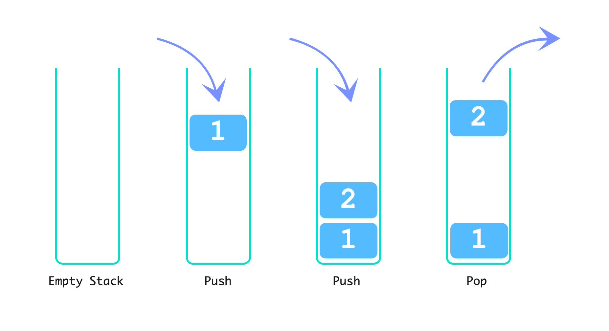
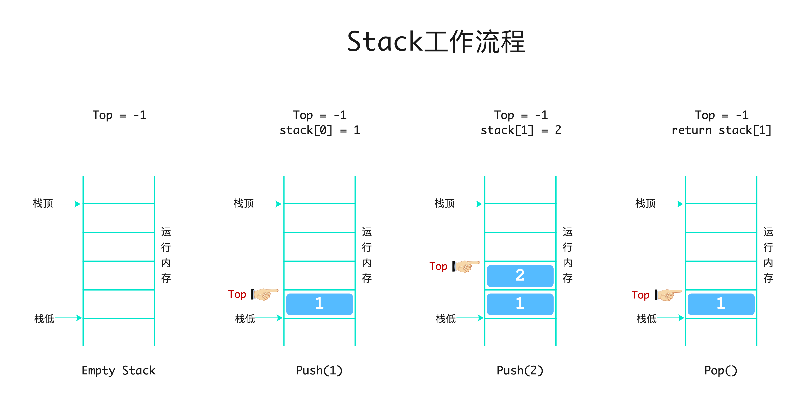

# 栈(Stack)
[参考链接](https://www.programiz.com/dsa/stack)  
堆栈是遵循后进先出 (LIFO)原则的线性数据结构。这意味着插入堆栈中的最后一个元素首先被删除。  

- ## LIFO 栈原理  

在编程术语中，将一个元素放在堆栈顶部称为push，删除一个元素称为pop。  

 

    </img>  

 

最后添加的元素，最先被移除。  

- ## 栈的基本操作  

- `Push` 将一个元素添加到栈顶
- `Pop` 从栈顶移除一个元素
- `IsEmpty` 检查堆栈是否为空
- `IsFull` 检查堆栈是否已满
- `Peek` 获取顶部元素的值而不删除它

- ## 栈的工作原理  
操作如下:  
1. 一个`TOP`指针用于跟踪栈中的顶部元素；  
2. 在初始化栈时，我们将其值设置为 `-1`，以便我们可以通过比较来检查堆栈是否为空`TOP == -1`；
3. 在`Push`一个元素时，增加`TOP`的值，并将新元素放置在`TOP`指向的位置；
4. 在`Pop`一个元素时，先返回`TOP`指向的元素,并减少`TOP`的值；
5. 在 `Push` 之前，检查栈是否已经满了`TOP == Capacity`；
6. 在`Pop`之前，检查堆栈是否已经为空`TOP == -1`。

 

    </img>  

 

- ## 栈的C++/Java/Go实现  

- ## 栈的时间复杂度  

- ## 栈的应用场景    

